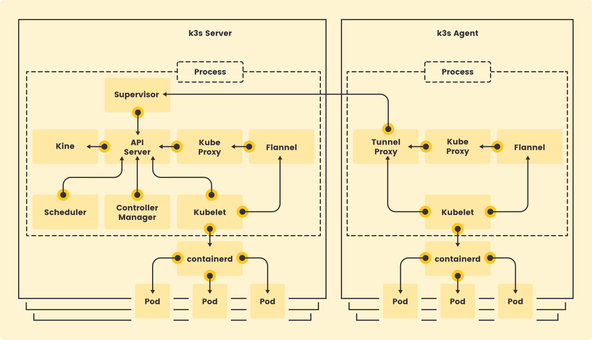

# K3s: Lightweight Kubernetes 🚀

K3s is a lightweight, easy-to-install Kubernetes distribution that requires half the memory of typical Kubernetes setups. It packages all the necessary dependencies into a single binary of less than 100 MB, making it ideal for edge computing, IoT, and resource-constrained environments.

## ✨ Key Features

K3s comes pre-bundled with essential components for a fully functional Kubernetes cluster:

- **Container Runtime Interface (CRI):** Supports `containerd` and `cri-dockerd`.
- **Flannel:** Container Network Interface (CNI) for network overlay.
- **CoreDNS:** Provides cluster DNS services.
- **Traefik:** Ingress controller for routing traffic.
- **ServiceLB:** Load balancer for services.
- **Kube-router:** Manages network policies.
- **Local Path Provisioner:** For persistent volume management.
- **Spegel:** Distributed container image registry mirror.
- **Host Utilities:** Includes necessary tools like `iptables`, `socat`, etc.

## 🏗️ K3s Architecture


K3s simplifies Kubernetes setup by including all the necessary components in a "batteries-included" approach. It streamlines the process of setting up a cluster, making it an excellent choice for quick deployments and air-gapped environments.

## 🛠️ Installation Steps

Follow these steps to set up an air-gapped K3s cluster with a private registry. 
**Note**: These steps assume that the firewall is disabled. If you intend to perform the installation with the firewall enabled, please review the necessary ports that must be open on the master and worker nodes. For more information, refer to the [K3s Networking Requirements](https://docs.k3s.io/installation/requirements#networking).


### 1. Download K3s Images

Download the K3s images from the [K3s GitHub releases](https://github.com/k3s-io/k3s/releases):

```bash
tar xvf k3s-airgap-images-amd64.tar.gz
```

### 2. Prepare and Upload Images to a Private Registry

First, create a project called `rancher` in your private container registry.

Then, use the following script to load and push the K3s images to your private registry:

1. Create a script file named `upload-k3s.sh`:

 ```
   vim upload-k3s.sh
```
2. Add the following content to the upload-k3s.sh script:

```
#!/bin/bash

# Define the URL of your private registry
REGISTRY="YOUR_PRIVATE_REGISTRY"

# Load the K3s images from the tar file
docker load -i k3s-airgap-images-amd64.tar.gz

# List and process all loaded K3s images
for image in $(docker images --format "{{.Repository}}:{{.Tag}}" | grep -E "rancher|klipper|pause|coredns|metrics-server"); do
  
  # Extract the original image name and tag
  original_name=$(echo $image | cut -d: -f1)
  tag=$(echo $image | cut -d: -f2)

  # Construct the new image name for your private registry
  new_name="$REGISTRY/rancher/${original_name##*/}:$tag"
  
  echo "Processing: $image -> $new_name"

  # Tag the image for your private registry
  docker tag $image $new_name

  # Push the image to your private registry
  docker push $new_name

  echo "Successfully pushed: $new_name"
done
```
3. Make the script executable:
```
chmod +x upload-k3s.sh
```
4. Execute the script to upload the images:
```
./upload-k3s.sh
```
### 3. Configure the Private Registry for K3s

To use your private registry with K3s, you need to create a registry configuration file and set the default registry. Follow the steps below:

#### 3.1 Create the Registry Configuration

1. Create the necessary directory for the K3s configuration:
```  
     mkdir -p /etc/rancher/k3s                                         
```
2. Create the registries.yaml file to configure the private registry:

```
cat << EOF > /etc/rancher/k3s/registries.yaml
mirrors:
  "docker.io":
    endpoints:
      - "https://YOUR_PRIVATE_REGISTRY"
  "rancher":
    endpoints:
      - "https://YOUR_PRIVATE_REGISTRY/rancher"

configs:
  "YOUR_PRIVATE_REGISTRY":
    tls:
      insecure_skip_verify: true
    auth:
      username: "USER_NAME"
      password: "PASSWORD"

  "YOUR_PRIVATE_REGISTRY/rancher":
    tls:
      insecure_skip_verify: true
    auth:
      username: "USER_NAME"
      password: "PASSWORD"
EOF
```


### 3.2 Set the Default Registry
1. Create the config.yaml file to define the default system registry:
```
cat << EOF > /etc/rancher/k3s/config.yaml
system-default-registry: "YOUR_PRIVATE_REGISTRY/rancher"
EOF
```


### 4. Download and Install K3s CLI Binary

To set up K3s on your air-gapped nodes, you first need to download the K3s CLI binary and installation script on a machine with internet access.

#### 4.1 Download the K3s CLI Binary

1. Download the K3s binary from the [K3s GitHub Releases](https://github.com/k3s-io/k3s/releases).

2. Transfer the binary to your master and worker nodes, and place it in the following directory:     **/usr/local/bin/k3s**
 
**Now Make the binary executable**:
```
chmod +x /usr/local/bin/k3s
```

4.2 Download the K3s Install Script 
1. Obtain the K3s installation script from https://get.k3s.io.
2. Save the script to each air-gapped node, naming it install.sh.
3. Make the installation script executable:
```
chmod +x install.sh
```
  ### 4.3 Install K3s Server (Single Controle Plane Node)
  1. Set an environment variable for the K3s token (used for node registration):
  ```
  export K3S_TOKEN="WRITE_ANY_TOKEN"
  ```
  2. Run the installation script, skipping the binary download since it is already present:

  ```
  INSTALL_K3S_SKIP_DOWNLOAD=true ./install.sh
  ```
Note: The Datebase in This Case will be sqllite
### 4.4 Install K3s Server (Multi Controle Plane Node)

1. Set an environment variable for the K3s token (used for node registration):
  ```
  export K3S_TOKEN="WRITE_ANY_TOKEN"
  ```
  2. Run the installation script, skipping the binary download since it is already present:

  ```
  INSTALL_K3S_SKIP_DOWNLOAD=true ./install.sh --cluster-init
  ```
Note: The Datebase in This Case will be etcd

### 5. Configure Pod Sandbox Image (Only if you encounter sandbox issues)

To ensure that K3s uses images from your private registry, you need to update the sandbox images used by `containerd`.

#### 5.1 Pull and Tag the Sandbox Images

1. Pull the required sandbox images from the Rancher repository:

   ```bash
   docker pull rancher/mirrored-pause:3.6
   docker pull rancher/pause:3.6
   ```
2. Tag the images for your private registry:
```
docker tag rancher/mirrored-pause:3.6 YOUR_PRIVATE_REGISTRY/rancher/mirrored-pause:3.6
docker tag rancher/pause:3.6 YOUR_PRIVATE_REGISTRY/rancher/pause:3.6
```
2. Push the tagged images to your private registry:
```
docker push YOUR_PRIVATE_REGISTRY/rancher/mirrored-pause:3.6
docker push YOUR_PRIVATE_REGISTRY/rancher/pause:3.6
```
### 5.2 Update the Control Plane Configuration
1. Copy the existing containerd configuration file and create a new template file called config.toml.tmpl:
```
cp /var/lib/rancher/k3s/agent/etc/containerd/config.toml /var/lib/rancher/k3s/agent/etc/containerd/config.toml.tmpl
```
2. Edit the new configuration file to specify the custom sandbox image::
```
vim /var/lib/rancher/k3s/agent/etc/containerd/config.toml.tmpl
```
3. Update the sandbox_image attribute:
```
sandbox_image = "YOUR_PRIVATE_REGISTRY/rancher/pause:3.6"
```
### 5.3 Restart K3s Service
To apply the new configuration, restart the K3s service:
```
systemctl restart k3s
```
### 5.3 Verify the Server Status
1. Ensure that the K3s server is running correctly:
```
k3s kubectl get nodes
```
2. Check the status of all pods across all namespaces:
```
k3s kubectl get pods -A
```
 ## Add a Another Controle Plane Node to the Cluster

  ### 1. Ensure the K3s CLI Binary is Installed on the Controle Plane Node

  Make sure that you have the `k3s` CLI binary available on the Controle Plane Node.

  ### 2. Get the Node Token from the First  Controle Plane Node

  On the master node, retrieve the node token by running the following command:

  ```bash
  cat /var/lib/rancher/k3s/server/token
  ```

### 3. Configure the Private Registry for K3s (Section 3)


5. Copy the Install Script to the Second  Controle Plane Node
  Copy the install.sh script from the master node to the Second  Controle Plane Node.

  6. Join the the Second  Controle Plane Node  to the Cluster

  Run the following command on the Second  Controle Plane Node  to join it to the cluster:

  ```
  export K3S_TOKEN="Server1-Token"  

INSTALL_K3S_SKIP_DOWNLOAD=true ./install.sh server \
  --server https://SERVER1_IP:6443 \

  ```
  7. Check the Service Status

  Check the status of the K3s  service:


  ```
  sudo systemctl status k3s
  ```

  8. Check the Logs


    To view the logs of the K3s agent, run:
  ```
   sudo journalctl -u k3s -f
  ```
  9. Verify the Node Status
  Finally, verify the node status by running:
  ```
  k3s kubectl get node
  ```


## Add a Worker Node to the Cluster

### 1. Ensure the K3s CLI Binary is Installed on the Worker Node

Make sure that you have the `k3s` CLI binary available on the worker node.

### 2. Get the Node Token from the Master Node

On the master node, retrieve the node token by running the following command:

```bash
cat /var/lib/rancher/k3s/server/node-token
```
### 3. Prepare the Worker Node Registration Script
1. Create the prepare-register.sh script on the worker node:
```
vim prepare-register.sh
```
2. Then, paste the following content into the script:

```
#!/bin/bash

mkdir -p /etc/rancher/k3s/
cat << 'EOT' > /etc/rancher/k3s/registries.yaml
mirrors:
  "docker.io":
    endpoints:
      - "https://YOUR_PRIVATE_REGISTRY"
  "rancher":
    endpoints:
      - "https://YOUR_PRIVATE_REGISTRY/rancher"
configs:
  "YOUR_PRIVATE_REGISTRY":
    tls:
      insecure_skip_verify: true
    auth:
      username: "USER_NAME"  
      password: "PASSWORD"
  "YOUR_PRIVATE_REGISTRY/rancher":
    tls:
      insecure_skip_verify: true
    auth:
      username: "USER_NAME"  
      password: "PASSWORD"
EOT
```
3. Make the Script Executable
```
chmod +x prepare-register.sh
```
4. Then, run the script:
```
./prepare-register.sh
```
5. Copy the Install Script to the Worker Node
Copy the install.sh script from the master node to the worker node.

6. Join the Worker Node to the Cluster

Run the following command on the worker node to join it to the cluster:

```
INSTALL_K3S_SKIP_DOWNLOAD=true K3S_URL=https://YOUR_MASTER_NODE_IP:6443 K3S_TOKEN=YOUR_TOKEN ./install.sh agent
```
7. Check the Service Status

Check the status of the K3s agent service:


```
sudo systemctl status k3s-agent
```

8. Check the Logs


  To view the logs of the K3s agent, run:
```
 sudo journalctl -u k3s-agent -f
```
9. Verify the Node Status
Finally, verify the node status by running:
```
k3s kubectl get node
```
## Troubleshooting

### Issue: Unable to View Pod Logs

If you encounter an issue where you are unable to view pod logs and receive a "forbidden" error, follow these steps to resolve it:

1. Add the following line to the `k3s.service.env` file:

    ```bash
    NO_PROXY='127.0.0.1,localhost,172.0.0.0/8,10.0.0.0/8'
    ```

2. Edit the file by running:

    ```bash
    vim /etc/systemd/system/k3s.service.env
    ```

3. After making the changes, restart the K3s service:

    ```bash
    systemctl restart k3s
    ```

This should resolve the issue and allow you to view the pod logs.

### Issue: Unable to Join Another Control Plane Node due to Existing Hostname in etcd Database
When trying to join a new control plane node and encountering an error indicating that the hostname already exists in the etcd database, follow these steps to resolve the issue.
#### Steps:


1. **Access the Master Node** 
 
Log into one of the master nodes that is running properly and ensure that the etcd binary is installed. If it's not installed, download it and transfer the binary to the node under /usr/local/bin.

2. **List Cluster Members**

Use the following command to list the members of the cluster:
```
ETCDCTL_API=3 etcdctl \
  --endpoints=https://127.0.0.1:2379 \
  --cert=/var/lib/rancher/k3s/server/tls/etcd/server-client.crt \
  --key=/var/lib/rancher/k3s/server/tls/etcd/server-client.key \
  --cacert=/var/lib/rancher/k3s/server/tls/etcd/server-ca.crt \
  member list
```
This will display the list of cluster members along with their respective records.

3. **Remove the Existing Record of the Second Control Plane Node**

To remove the record of the second control plane node, run the following command:
```
ETCDCTL_API=3 etcdctl \
  --endpoints=https://127.0.0.1:2379 \
  --cert=/var/lib/rancher/k3s/server/tls/etcd/server-client.crt \
  --key=/var/lib/rancher/k3s/server/tls/etcd/server-client.key \
  --cacert=/var/lib/rancher/k3s/server/tls/etcd/server-ca.crt \
  member remove <NODE_ID>
```
Replace <NODE_ID> with the actual ID of the second control plane node you wish to remove (you will find this in the output of the member list command).


4. **Register the Second Control Plane Node Again**

After successfully removing the node record, try registering the second control plane node again.

This should resolve the issue and allow you to join the second control plane node to the cluster.

